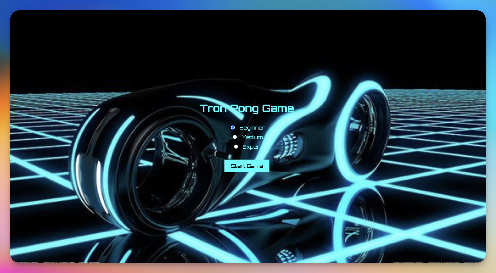
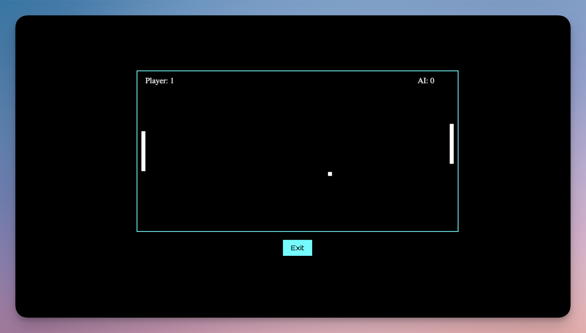
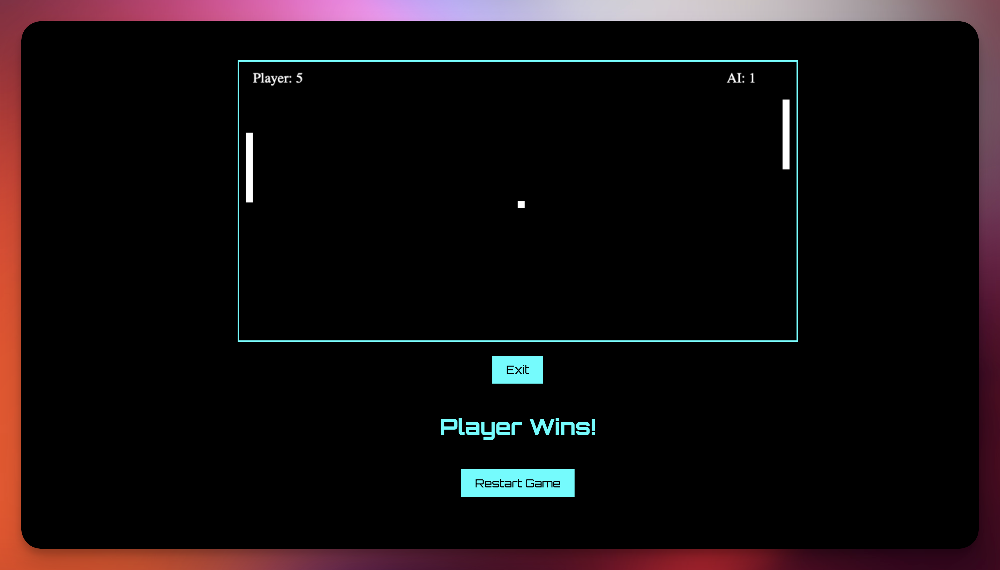

# Tron Pong Game

A retro-style Pong game with a Tron Legacy theme, built using HTML, CSS, and JavaScript.

## Table of Contents

- [Introduction](#introduction)
- [Features](#features)
- [Installation](#installation)
- [Usage](#usage)
- [Screenshots](#screenshots)
- [Contributing](#contributing)
- [License](#license)

## Introduction

Tron Pong Game is a modern take on the classic Pong game, featuring a Tron Legacy theme. Players can choose from three difficulty levels and compete against an AI opponent. The game ends when a player reaches a score of 5, and the winner is displayed on the screen.

## Features

- Retro-style graphics with a Tron Legacy theme
- Three difficulty levels: Beginner, Medium, Expert
- AI opponent with adjustable difficulty
- Score tracking and game end condition
- Splash screen with game instructions
- Option to restart the game
- **New**: Gamepad controller support

## Installation

1. Clone the repository:
    ```bash
    git clone https://github.com/yourusername/tron-pong-game.git
    ```

2. Navigate to the project directory:
    ```bash
    cd tron-pong-game
    ```

3. Open `index.html` in your web browser to start the game.

## Usage

1. Open the game in your web browser.
2. On the splash screen, select a difficulty level.
3. Click the "Start Game" button to begin.
4. Use the arrow keys or a gamepad controller to move your paddle up and down.
5. The game ends when a player reaches a score of 5.
6. The winner is displayed on the screen, and you can restart the game by clicking the "Restart Game" button.

## Screenshots

### Splash Screen


### Game Screen


### Winner Screen


## Contributing

Contributions are welcome! Please fork the repository and submit a pull request with your changes.

## License

This project is licensed under the MIT License. See the [LICENSE](LICENSE) file for details.