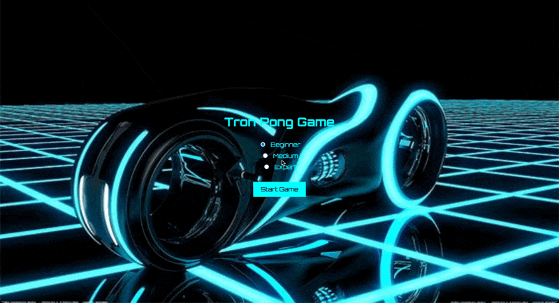
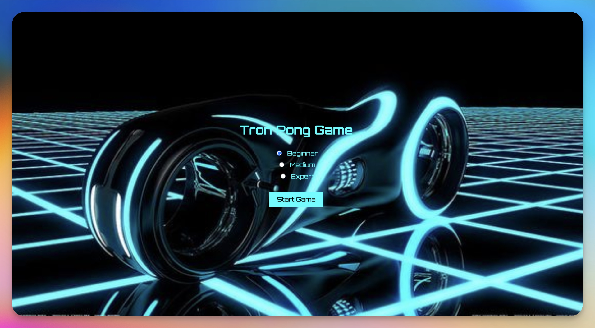
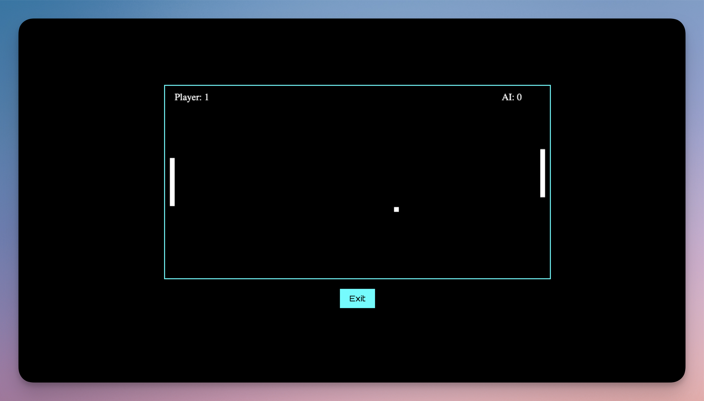
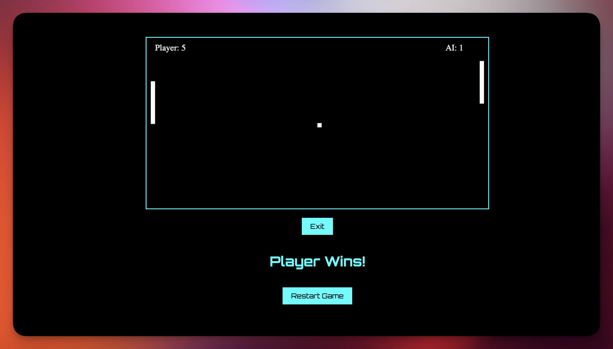

# Tron Pong Game

A retro-style Pong game with a Tron Legacy theme, built using HTML, CSS, and JavaScript.

## Table of Contents

- [Introduction](#introduction)
- [Features](#features)
- [Technical Stack](#technical-stack)
- [Browser Compatibility](#browser-compatibility)
- [Controls](#controls)
- [Installation](#installation)
- [Development Setup](#development-setup)
- [Usage](#usage)
- [Screenshots](#screenshots)
- [Video](#video)
- [Project Structure](#project-structure)
- [Performance Optimization](#performance-optimization)
- [Troubleshooting](#troubleshooting)
- [Upcoming Features](#upcoming-features)
- [Contributing](#contributing)
- [License](#license)

## Introduction

Tron Pong Game is a modern take on the classic Pong game, featuring a Tron Legacy theme. Players can choose from three difficulty levels and compete against an AI opponent. The game ends when a player reaches a score of 5, and the winner is displayed on the screen.

## Features

- Retro-style graphics with a Tron Legacy theme
- Three difficulty levels: Beginner, Medium, Expert
- AI opponent with adjustable difficulty
- Score tracking and game end condition
- Splash screen with game instructions
- Option to restart the game
- Responsive design that adapts to different screen sizes
- Smooth animations and particle effects
- Gamepad controller support
- Sound effects and background music
- Local storage for high scores

## Technical Stack

- **Frontend**: Pure HTML5, CSS3, and Vanilla JavaScript (ES6+)
- **Graphics**: HTML5 Canvas API for rendering
- **Audio**: Web Audio API for sound effects
- **Input**: Keyboard API and Gamepad API for controls
- **Storage**: Local Storage API for saving game state
- **Animation**: RequestAnimationFrame API for smooth gameplay

## Browser Compatibility

The game has been tested and works on:
- Chrome (v70+)
- Firefox (v65+)
- Safari (v12+)
- Edge (v79+)

## Controls

- **Keyboard**:
  - ↑ (Up Arrow): Move paddle up
  - ↓ (Down Arrow): Move paddle down
  - Space: Pause/Resume game
  - R: Restart game
  
- **Gamepad**:
  - Left Analog Stick / D-pad: Move paddle
  - Start Button: Pause/Resume
  - Select Button: Restart game

## Installation

1. Clone the repository:
    ```bash
    git clone https://github.com/yourusername/tron-pong-game.git
    ```

2. Navigate to the project directory:
    ```bash
    cd tron-pong-game
    ```

3. Open `index.html` in your web browser to start the game.

### Development Setup

1. Install a local development server (optional):
    ```bash
    npm install -g live-server
    ```

2. Start the development server:
    ```bash
    live-server
    ```

3. The game will open automatically in your default browser at `http://localhost:8080`

## Usage

1. Open the game in your web browser.
2. On the splash screen, select a difficulty level.
3. Click the "Start Game" button to begin.
4. Use the arrow keys or a gamepad controller to move your paddle up and down.
5. The game ends when a player reaches a score of 5.
6. The winner is displayed on the screen, and you can restart the game by clicking the "Restart Game" button.

## Video



## Screenshots

### Splash Screen


### Game Screen


### Winner Screen


## Project Structure

```
tron-pong-game/
├── index.html          # Main HTML file
├── styles.css          # Game styles and animations
├── game.js            # Game logic and mechanics
└── images/            # Game assets
    ├── 1.jpg          # Splash screen screenshot
    ├── 2.jpg          # Game screen screenshot
    ├── 3.jpg          # Winner screen screenshot
    └── 4.gif          # Gameplay demo
```

## Performance Optimization

The game implements several optimization techniques:
- RequestAnimationFrame for smooth animations
- Event delegation for efficient event handling
- Sprite batching for improved rendering
- Asset preloading for faster startup
- Efficient collision detection algorithms

## Troubleshooting

Common issues and solutions:

1. **Game feels laggy**:
   - Ensure your browser is up to date
   - Close unnecessary browser tabs
   - Check if hardware acceleration is enabled

2. **No sound**:
   - Check if your browser allows autoplay
   - Verify system sound settings
   - Try refreshing the page

3. **Controller not working**:
   - Ensure controller is connected before starting the game
   - Check if your browser supports the Gamepad API
   - Try reconnecting the controller

## Upcoming Features

- Online multiplayer support
- Additional game modes
- Customizable paddle and ball skins
- Global leaderboard
- Achievement system

## Contributing

Contributions are welcome! Please fork the repository and submit a pull request with your changes.

## License

This project is licensed under the MIT License. See the [LICENSE](LICENSE) file for details.